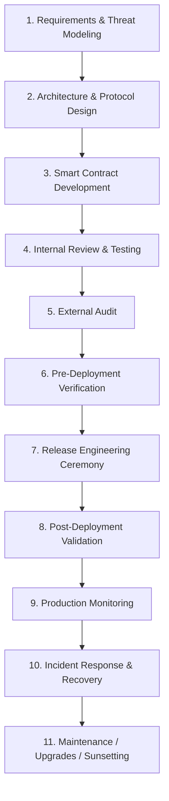

# DeFi dApp Development Project Lifecycle

> **Status: Draft.** This document captures working ideas imported from Notion. Role assignments, control thresholds, cited incident claims, and standards mappings require validation before adoption as an approved standard.
>
> **Source note:** This file is an edited, non-normative working draft. The private source is not a reproducible public reference; incident and standards claims require primary-source review before reuse.

**Doc Type:** Standard
**Date:** 2025-11-26
**Department:** Security / Engineering / Product
**Purpose:**
To define a candidate secure lifecycle for DeFi dApp development, covering requirements → deployment → monitoring, with RACI assignments and security gates informed by public incident reports.
**Scope:**
Applies to all product, engineering, security, DevOps, auditors, and release engineering personnel.
---
# 1. **High-Level Lifecycle Diagram (Mermaid)**

---
# 2. **Lifecycle Stage Definitions**
## **1. Requirements & Threat Modeling**
Definition of business logic, security assumptions, and failure scenarios (e.g., validator compromise, key theft, initialization errors, economic attack vectors).
### Key risks identified from historical incident reports
- Incorrect trust assumptions (Ronin: centralized validator key compromise )
- Poor governance design (Beanstalk: flash loan takeover )
- Missing invariant definitions (Euler: solvency logic failure )
---
## **2. Architecture & Protocol Design**
Formal design of smart contracts, off-chain components, oracles, bridges, governance, upgradeability, admin keys, and treasury flows.
### Security Gates:
- Economic model reviewed
- Upgradability risks evaluated
- Admin key trust assumptions defined
- Oracle manipulation vectors analyzed (Curve, KyberSwap, etc. )
---
## **3. Smart Contract Development**
Development in Solidity, Vyper, Rust, etc.
### Security Expectations:
- Reentrancy guards
- Safe math
- Access control verification
- Economic invariants enforced
---
## **4. Internal Review & Testing**
Unit tests, integration tests, fuzzing, invariant-based testing.
### Security Expectations:
- 100% critical-path test coverage
- All invariants implemented and verified
- Static and dynamic analysis passed
---
## **5. External Audit**
Independent vulnerability analysis.
### Risk Scenario:
Audit gaps leading to failures not covered by auditors (Nomad: initialization error despite audit scope limitation ).
---
## **6. Pre-Deployment Verification**
Verifies the exact commit, parameters, and deployment scripts.
Includes: deterministic builds, dependency audit, simulation (Tenderly, Foundry).
---
## **7. Release Engineering Ceremony**
A multi-party, formalized signing event ensuring what is deployed is exactly what was audited.
Relevant exploit history:
- Developers deploying insecure / unverified code (Nomad init error )
- Weak key-generation or key-management controls (for example, the Wintermute Profanity vulnerability)
- Inadequate signing and deployment controls (incident-specific facts must be verified against the primary post-mortem)
---
## **8. Post-Deployment Validation**
On-chain verification of state, ownership, initialization, and configuration.
---
## **9. Production Monitoring**
Real-time monitoring of oracles, liquidity pools, governance changes, anomalous activity, and threat intelligence feeds.
---
## **10. Incident Response**
Emergency pause, governance action, communication, law enforcement liaison, and forensic workflow.
---
## **11. Maintenance & Sunsetting**
Upgrade cycles, deprecation, key rotation, archive policies.
---
# 3. **RACI Matrix Per Lifecycle Stage**
Below is the complete matrix.
### **Roles Legend**
- **CISO**
- **Web3 Release Engineer (WRE)**
- **DevSecOps Engineer (DSO)**
- **Smart Contract Developer (SCD)**
- **Frontend/DApp Engineer (FDE)**
- **QA/Testing Lead (QA)**
- **Auditor (AUD)**
- **Product Manager / Guardian (PM)**
- **Compliance Officer (CO)**
- **Risk Manager (RM)**
- **Incident Response Lead (IR)**
---
# **Stage 1 — Requirements & Threat Modeling — RACI**
<table>
<tr>
<td>Activity</td>
<td>CISO</td>
<td>WRE</td>
<td>DSO</td>
<td>SCD</td>
<td>FDE</td>
<td>QA</td>
<td>AUD</td>
<td>PM</td>
<td>CO</td>
<td>RM</td>
<td>IR</td>
</tr>
<tr>
<td>Business Requirements</td>
<td>I</td>
<td>I</td>
<td>I</td>
<td>I</td>
<td>I</td>
<td>I</td>
<td>I</td>
<td>A/R</td>
<td>C</td>
<td>C</td>
<td>I</td>
</tr>
<tr>
<td>Threat Modeling</td>
<td>A</td>
<td>C</td>
<td>R</td>
<td>C</td>
<td>C</td>
<td>C</td>
<td>C</td>
<td>C</td>
<td>C</td>
<td>A/R</td>
<td>I</td>
</tr>
<tr>
<td>Attack Surface Analysis</td>
<td>A</td>
<td>C</td>
<td>R</td>
<td>C</td>
<td>C</td>
<td>C</td>
<td>C</td>
<td>C</td>
<td>C</td>
<td>R</td>
<td>I</td>
</tr>
<tr>
<td>Define Security Assumptions</td>
<td>A</td>
<td>C</td>
<td>R</td>
<td>C</td>
<td>C</td>
<td>C</td>
<td>C</td>
<td>C</td>
<td>C</td>
<td>A/R</td>
<td>I</td>
</tr>
<tr>
<td>Economic Model Risk Review</td>
<td>C</td>
<td>I</td>
<td>I</td>
<td>C</td>
<td>I</td>
<td>I</td>
<td>C</td>
<td>A/R</td>
<td>C</td>
<td>A/R</td>
<td>I</td>
</tr>
</table>
---
# **Stage 2 — Architecture & Protocol Design — RACI**
<table>
<tr>
<td>Activity</td>
<td>CISO</td>
<td>WRE</td>
<td>DSO</td>
<td>SCD</td>
<td>FDE</td>
<td>QA</td>
<td>AUD</td>
<td>PM</td>
<td>CO</td>
<td>RM</td>
<td>IR</td>
</tr>
<tr>
<td>Protocol Logical Architecture</td>
<td>C</td>
<td>C</td>
<td>C</td>
<td>R</td>
<td>C</td>
<td>C</td>
<td>C</td>
<td>A</td>
<td>I</td>
<td>C</td>
<td>I</td>
</tr>
<tr>
<td>Admin Key / Governance Model</td>
<td>A/R</td>
<td>C</td>
<td>C</td>
<td>C</td>
<td>I</td>
<td>I</td>
<td>C</td>
<td>A/R</td>
<td>C</td>
<td>A/R</td>
<td>I</td>
</tr>
<tr>
<td>Oracle & Price Feed Design</td>
<td>C</td>
<td>I</td>
<td>C</td>
<td>R</td>
<td>I</td>
<td>I</td>
<td>C</td>
<td>C</td>
<td>I</td>
<td>A/R</td>
<td>I</td>
</tr>
<tr>
<td>Upgradeability Design</td>
<td>A/R</td>
<td>C</td>
<td>C</td>
<td>R</td>
<td>I</td>
<td>I</td>
<td>C</td>
<td>C</td>
<td>I</td>
<td>C</td>
<td>I</td>
</tr>
<tr>
<td>Security Architecture Review</td>
<td>A</td>
<td>R</td>
<td>C</td>
<td>C</td>
<td>C</td>
<td>C</td>
<td>C</td>
<td>C</td>
<td>C</td>
<td>C</td>
<td>I</td>
</tr>
</table>
---
# **Stage 3 — Smart Contract Development — RACI**
<table>
<tr>
<td>Activity</td>
<td>CISO</td>
<td>WRE</td>
<td>DSO</td>
<td>SCD</td>
<td>FDE</td>
<td>QA</td>
<td>AUD</td>
<td>PM</td>
<td>CO</td>
<td>RM</td>
<td>IR</td>
</tr>
<tr>
<td>Smart Contract Coding</td>
<td>I</td>
<td>I</td>
<td>C</td>
<td>R</td>
<td>I</td>
<td>I</td>
<td>C</td>
<td>C</td>
<td>I</td>
<td>I</td>
<td>I</td>
</tr>
<tr>
<td>Unit Test Development</td>
<td>I</td>
<td>I</td>
<td>C</td>
<td>R</td>
<td>I</td>
<td>C</td>
<td>C</td>
<td>C</td>
<td>I</td>
<td>I</td>
<td>I</td>
</tr>
<tr>
<td>Static Analysis</td>
<td>C</td>
<td>I</td>
<td>R</td>
<td>R</td>
<td>I</td>
<td>C</td>
<td>C</td>
<td>I</td>
<td>I</td>
<td>I</td>
<td>I</td>
</tr>
<tr>
<td>Invariant Test Definition</td>
<td>C</td>
<td>I</td>
<td>C</td>
<td>R</td>
<td>I</td>
<td>R</td>
<td>C</td>
<td>C</td>
<td>I</td>
<td>A/R</td>
<td>I</td>
</tr>
<tr>
<td>Internal Code Review</td>
<td>C</td>
<td>I</td>
<td>C</td>
<td>A/R</td>
<td>I</td>
<td>C</td>
<td>C</td>
<td>I</td>
<td>I</td>
<td>C</td>
<td>I</td>
</tr>
</table>
---
# **Stage 4 — Internal Review & Testing — RACI**
<table>
<tr>
<td>Activity</td>
<td>CISO</td>
<td>WRE</td>
<td>DSO</td>
<td>SCD</td>
<td>FDE</td>
<td>QA</td>
<td>AUD</td>
<td>PM</td>
<td>CO</td>
<td>RM</td>
<td>IR</td>
</tr>
<tr>
<td>Integration Testing</td>
<td>I</td>
<td>I</td>
<td>C</td>
<td>R</td>
<td>R</td>
<td>A/R</td>
<td>I</td>
<td>C</td>
<td>I</td>
<td>I</td>
<td>I</td>
</tr>
<tr>
<td>Fuzzing</td>
<td>I</td>
<td>I</td>
<td>R</td>
<td>R</td>
<td>I</td>
<td>A/R</td>
<td>C</td>
<td>I</td>
<td>I</td>
<td>I</td>
<td>I</td>
</tr>
<tr>
<td>Invariant Testing</td>
<td>I</td>
<td>I</td>
<td>C</td>
<td>R</td>
<td>I</td>
<td>A/R</td>
<td>C</td>
<td>I</td>
<td>I</td>
<td>A/R</td>
<td>I</td>
</tr>
<tr>
<td>Security Issue Remediation</td>
<td>C</td>
<td>I</td>
<td>C</td>
<td>A/R</td>
<td>C</td>
<td>C</td>
<td>C</td>
<td>C</td>
<td>I</td>
<td>C</td>
<td>I</td>
</tr>
</table>
---
# **Stage 5 — External Audit — RACI**
<table>
<tr>
<td>Activity</td>
<td>CISO</td>
<td>WRE</td>
<td>DSO</td>
<td>SCD</td>
<td>FDE</td>
<td>QA</td>
<td>AUD</td>
<td>PM</td>
<td>CO</td>
<td>RM</td>
<td>IR</td>
</tr>
<tr>
<td>Audit Scoping</td>
<td>A/R</td>
<td>C</td>
<td>C</td>
<td>C</td>
<td>I</td>
<td>I</td>
<td>R</td>
<td>A/R</td>
<td>C</td>
<td>C</td>
<td>I</td>
</tr>
<tr>
<td>Audit Execution</td>
<td>I</td>
<td>I</td>
<td>I</td>
<td>C</td>
<td>I</td>
<td>I</td>
<td>R</td>
<td>I</td>
<td>I</td>
<td>I</td>
<td>I</td>
</tr>
<tr>
<td>Audit Findings Review</td>
<td>A/R</td>
<td>C</td>
<td>C</td>
<td>R</td>
<td>C</td>
<td>C</td>
<td>R</td>
<td>C</td>
<td>C</td>
<td>A/R</td>
<td>I</td>
</tr>
<tr>
<td>Fixes & Verification</td>
<td>C</td>
<td>C</td>
<td>C</td>
<td>A/R</td>
<td>C</td>
<td>C</td>
<td>R</td>
<td>I</td>
<td>I</td>
<td>C</td>
<td>I</td>
</tr>
</table>
---
# **Stage 6 — Pre-Deployment Verification — RACI**
<table>
<tr>
<td>Activity</td>
<td>CISO</td>
<td>WRE</td>
<td>DSO</td>
<td>SCD</td>
<td>FDE</td>
<td>QA</td>
<td>AUD</td>
<td>PM</td>
<td>CO</td>
<td>RM</td>
<td>IR</td>
</tr>
<tr>
<td>Verify Commit Hash</td>
<td>C</td>
<td>A/R</td>
<td>C</td>
<td>R</td>
<td>I</td>
<td>I</td>
<td>C</td>
<td>I</td>
<td>I</td>
<td>I</td>
<td>I</td>
</tr>
<tr>
<td>Deterministic Build Verification</td>
<td>C</td>
<td>A/R</td>
<td>C</td>
<td>C</td>
<td>I</td>
<td>I</td>
<td>C</td>
<td>I</td>
<td>I</td>
<td>I</td>
<td>I</td>
</tr>
<tr>
<td>Simulation (Tenderly/Foundry)</td>
<td>I</td>
<td>A/R</td>
<td>C</td>
<td>R</td>
<td>I</td>
<td>C</td>
<td>C</td>
<td>I</td>
<td>I</td>
<td>I</td>
<td>I</td>
</tr>
<tr>
<td>Deployment Script Review</td>
<td>C</td>
<td>A/R</td>
<td>C</td>
<td>R</td>
<td>I</td>
<td>I</td>
<td>C</td>
<td>C</td>
<td>I</td>
<td>C</td>
<td>I</td>
</tr>
<tr>
<td>Dependency Supply-Chain Scan</td>
<td>A/R</td>
<td>C</td>
<td>R</td>
<td>C</td>
<td>C</td>
<td>C</td>
<td>I</td>
<td>I</td>
<td>C</td>
<td>I</td>
<td>I</td>
</tr>
</table>
---
# **Stage 7 — Release Engineering Ceremony — RACI**
<table>
<tr>
<td>Activity</td>
<td>CISO</td>
<td>WRE</td>
<td>DSO</td>
<td>SCD</td>
<td>FDE</td>
<td>QA</td>
<td>AUD</td>
<td>PM</td>
<td>CO</td>
<td>RM</td>
<td>IR</td>
</tr>
<tr>
<td>Ceremony Execution</td>
<td>C</td>
<td>A/R</td>
<td>C</td>
<td>C</td>
<td>I</td>
<td>I</td>
<td>C</td>
<td>C</td>
<td>I</td>
<td>C</td>
<td>I</td>
</tr>
<tr>
<td>Multi-Signer Coordination</td>
<td>I</td>
<td>A/R</td>
<td>I</td>
<td>I</td>
<td>I</td>
<td>I</td>
<td>C</td>
<td>C</td>
<td>I</td>
<td>I</td>
<td>I</td>
</tr>
<tr>
<td>Hardware Wallet Control</td>
<td>A/R</td>
<td>R</td>
<td>C</td>
<td>C</td>
<td>I</td>
<td>I</td>
<td>I</td>
<td>I</td>
<td>I</td>
<td>C</td>
<td>I</td>
</tr>
<tr>
<td>Verify Transaction Payload</td>
<td>A/R</td>
<td>R</td>
<td>C</td>
<td>C</td>
<td>I</td>
<td>I</td>
<td>C</td>
<td>C</td>
<td>I</td>
<td>C</td>
<td>I</td>
</tr>
<tr>
<td>Nonce & Gas Strategy Validation</td>
<td>I</td>
<td>A/R</td>
<td>R</td>
<td>C</td>
<td>I</td>
<td>I</td>
<td>I</td>
<td>I</td>
<td>I</td>
<td>I</td>
<td>I</td>
</tr>
</table>
---
# **Stage 8 — Post-Deployment Validation — RACI**
<table>
<tr>
<td>Activity</td>
<td>CISO</td>
<td>WRE</td>
<td>DSO</td>
<td>SCD</td>
<td>FDE</td>
<td>QA</td>
<td>AUD</td>
<td>PM</td>
<td>CO</td>
<td>RM</td>
<td>IR</td>
</tr>
<tr>
<td>Initialization Verification</td>
<td>C</td>
<td>A/R</td>
<td>R</td>
<td>R</td>
<td>I</td>
<td>C</td>
<td>C</td>
<td>I</td>
<td>I</td>
<td>I</td>
<td>I</td>
</tr>
<tr>
<td>Ownership Transfer Verification</td>
<td>A/R</td>
<td>R</td>
<td>C</td>
<td>C</td>
<td>I</td>
<td>I</td>
<td>C</td>
<td>C</td>
<td>I</td>
<td>C</td>
<td>I</td>
</tr>
<tr>
<td>Source Code Verification</td>
<td>I</td>
<td>A/R</td>
<td>C</td>
<td>R</td>
<td>I</td>
<td>I</td>
<td>C</td>
<td>C</td>
<td>I</td>
<td>I</td>
<td>I</td>
</tr>
<tr>
<td>Parameter Final Checks</td>
<td>C</td>
<td>A/R</td>
<td>R</td>
<td>R</td>
<td>I</td>
<td>I</td>
<td>C</td>
<td>C</td>
<td>C</td>
<td>C</td>
<td>I</td>
</tr>
</table>
---
# **Stage 9 — Production Monitoring — RACI**
<table>
<tr>
<td>Activity</td>
<td>CISO</td>
<td>WRE</td>
<td>DSO</td>
<td>SCD</td>
<td>FDE</td>
<td>QA</td>
<td>AUD</td>
<td>PM</td>
<td>CO</td>
<td>RM</td>
<td>IR</td>
</tr>
<tr>
<td>Monitor Contract Events</td>
<td>I</td>
<td>R</td>
<td>A/R</td>
<td>C</td>
<td>I</td>
<td>C</td>
<td>I</td>
<td>I</td>
<td>I</td>
<td>C</td>
<td>I</td>
</tr>
<tr>
<td>Oracle / Price Feed Monitoring</td>
<td>C</td>
<td>C</td>
<td>A/R</td>
<td>C</td>
<td>I</td>
<td>I</td>
<td>I</td>
<td>I</td>
<td>I</td>
<td>A/R</td>
<td>I</td>
</tr>
<tr>
<td>Governance Queue Monitoring</td>
<td>A/R</td>
<td>C</td>
<td>C</td>
<td>C</td>
<td>I</td>
<td>I</td>
<td>I</td>
<td>C</td>
<td>C</td>
<td>C</td>
<td>I</td>
</tr>
<tr>
<td>Threat Intelligence Integration</td>
<td>A/R</td>
<td>R</td>
<td>C</td>
<td>C</td>
<td>I</td>
<td>I</td>
<td>I</td>
<td>I</td>
<td>C</td>
<td>A/R</td>
<td>I</td>
</tr>
</table>
---
# **Stage 10 — Incident Response — RACI**
<table>
<tr>
<td>Activity</td>
<td>CISO</td>
<td>WRE</td>
<td>DSO</td>
<td>SCD</td>
<td>FDE</td>
<td>QA</td>
<td>AUD</td>
<td>PM</td>
<td>CO</td>
<td>RM</td>
<td>IR</td>
</tr>
<tr>
<td>Emergency Pause</td>
<td>A/R</td>
<td>C</td>
<td>C</td>
<td>C</td>
<td>I</td>
<td>I</td>
<td>I</td>
<td>I</td>
<td>I</td>
<td>C</td>
<td>R</td>
</tr>
<tr>
<td>Forensic Analysis</td>
<td>A/R</td>
<td>C</td>
<td>C</td>
<td>R</td>
<td>I</td>
<td>I</td>
<td>C</td>
<td>I</td>
<td>I</td>
<td>C</td>
<td>A/R</td>
</tr>
<tr>
<td>Exchange Notifications</td>
<td>C</td>
<td>I</td>
<td>I</td>
<td>I</td>
<td>I</td>
<td>I</td>
<td>I</td>
<td>I</td>
<td>A/R</td>
<td>C</td>
<td>C</td>
</tr>
<tr>
<td>Communication Plan</td>
<td>C</td>
<td>I</td>
<td>I</td>
<td>I</td>
<td>I</td>
<td>I</td>
<td>I</td>
<td>A/R</td>
<td>C</td>
<td>C</td>
<td>C</td>
</tr>
</table>
---
# **Stage 11 — Upgrades & Sunsetting — RACI**
<table>
<tr>
<td>Activity</td>
<td>CISO</td>
<td>WRE</td>
<td>DSO</td>
<td>SCD</td>
<td>FDE</td>
<td>QA</td>
<td>AUD</td>
<td>PM</td>
<td>CO</td>
<td>RM</td>
<td>IR</td>
</tr>
<tr>
<td>Upgrade Proposal Creation</td>
<td>C</td>
<td>C</td>
<td>C</td>
<td>A/R</td>
<td>C</td>
<td>C</td>
<td>C</td>
<td>C</td>
<td>C</td>
<td>C</td>
<td>I</td>
</tr>
<tr>
<td>Timelock Execution</td>
<td>C</td>
<td>A/R</td>
<td>C</td>
<td>C</td>
<td>I</td>
<td>I</td>
<td>I</td>
<td>C</td>
<td>I</td>
<td>C</td>
<td>I</td>
</tr>
<tr>
<td>Key Rotation</td>
<td>A/R</td>
<td>R</td>
<td>C</td>
<td>I</td>
<td>I</td>
<td>I</td>
<td>I</td>
<td>I</td>
<td>C</td>
<td>I</td>
<td>C</td>
</tr>
<tr>
<td>Sunsetting Plan</td>
<td>A/R</td>
<td>C</td>
<td>C</td>
<td>C</td>
<td>C</td>
<td>C</td>
<td>C</td>
<td>R</td>
<td>C</td>
<td>A/R</td>
<td>C</td>
</tr>
</table>
---
# 4. **References (Standards + Exploits)**
### **Standards**
- ISO/IEC 27001, 27002, 27017, 27018
- ISO/TC 307 Blockchain Standards
- ISO 31000 Risk Management
- NIST RMF, NISTIR 8403
- CSA Blockchain/DLT WG
- OWASP Smart Contract Top 10
- OWASP Blockchain Application Security Standard
- CIS Controls v8
### **Incident-informed rationale (requires primary-source verification)**
- Ronin: centralized validator compromise → governance & key ceremony controls
- Nomad: initialization failure → mandatory post-deployment verification
- Wormhole: signature verification bypass → architecture integrity checks
- Wintermute: Profanity-generated key exposure → remediate key generation and compromise response; hardware-wallet use alone is not a complete control
- Beanstalk: flash loan governance attack → governance timelock requirements
- Euler: donation logic failure → invariants testing & solvency checks
---
